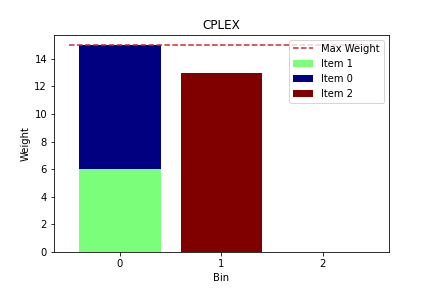

# Qiskit Hackathon Global

# NEW METHOD FOR INEQUALITY CONSTRAINED OPTIMIZATION PROBLEM

## The problem

Different optimization problems suited for being solved by quantum computers (QC) have inequality constraints that make a first approach of solving them really difficult for our current noise intermediate-scale quantum (NISQ) technology. This is because, the inequality constraints have to be converted into equality constraints and then, converted to binary representation and being solved with quadratic penalizations. The extra qubits added by these transformations and the resulting equation give us the motivation for looking at alternatives to get rid of the inequality constraints keeping the number of qubits constant. We will use the bin packing problem to test our alternative to the commonly used converter of the Qiskit library for inequality-constrained problems. For the solution, we use a variational quantum algorithm (VQA), the quantum approximate optimization algorithm (QAOA).

## Bin Packing Problem

The [bin packing problem](https://en.wikipedia.org/wiki/Bin_packing_problem) is an optimization problem where given a number of items with an assigned weight, we look at the best way to group the items minimizing the number of bins or containers needed to store them. The restriction, in this case, is the capacity of the bins which cannot surpass a certain weight. This problem has many real applications in areas as loading trucks with a weight restriction, filling up containers, and FPGA semiconductors chip design. 

In terms of complexity, the bin packing problem is an NP-hard problem. However, there are efficient algorithms that allow the arrangement of a large number of items. One of them is the first fit, which provides a fast but not optimal solution to the problem. 

For our problem, we will explore the solution of the bin packing problem, using a quantum computing representation in terms of quadratic unconstraint binary optimization (QUBO) and using the QAOA. 

### Problem statement

- n is the number of items
- m is the number of bins
- s(i) is the i-th item weight
- B is the maximum weight of the bin
-  is the variable that represent if the item i is in the bin j.
-  is the variable that represent if bin j is used

## The solution

We look for a heuristic approach based on a new penalization that does not increase the number of qubits for the solution on a QC and still accomplishes the penalization when the sum of the weights on a bin surpasses the maximum weight allowed. In this notebook, we will go through:

1) Codification of the problem

2) The classical approach

3) Our new approach

4) Comparison between both approaches

5) Conclusions

## 1. Codification of the problem

To construct the model, we use the library docplex. Once we have the problem as a cplex model, we use the function QuadraticProgram from qiskit_optimization to translate the problem and finally the function QuadraticProgramToQubo to convert the problem into the quadratic unconstrained binary optimization (QUBO) representation.

For this initial set, we chose a small problem. Here, we select 3 items with a maximal weight of 15. The weight of the items is chosen randomly from values between 1 and the maximal weight. 

### Simplifications

From this point and through the document, we make some simplifications for the problem being easy to solve, the problem variables can be reduced using the following simplifications:

- Removing unnecesary decision variables, the minimum number of bins should be at least equal to the sum of the weights of the items. 

- We assign the first item into the first bin.  

Therefore, the number of variables after the simplifications and assuming m = n: 

meanwhile for the original number of variables is:

a reduction of n + l variables.

## 2. The Classical approach: Solution with the QUBO simplication approach and QAOA

Once we have the problem as a QUBO representation, we can solve it using QAOA and the constrained optimization by linear approximation (COBYLA) algorithm. In this section, we show the results of the solution of the Bin Packing problem for three items, randomly selected weights, three QAOA repetitions, and max iterations number 10 for COBYLA.

Here, the two selections of the item 1 is an error in the solution of the objective function, where the QAOA using the classical QUBO converter is not able to find the optimal solution.

## 3. Our New approach: A Heuristic method to solve inequality constrained optimization problems

As we see above, translating the inequality constraints to equality constraints and binary representation has a large cost in terms of qubits. Therefore, we want to propose a new method that does not involve the use of more qubits than those needed to represent the bins and the items into the bins. Then, we need a penalization term that adds a large penality when the sum of weights of the items in a bin is greater than the maximum weight. We realize it with an exponential function of the form:

This equation has the property of been large for negative values, just what we want if the weights in the bins are greater than the maximum weight. However, we can not represent the exponential function using QUBOs. What we use is an approximation of the exponential to the second-order that is the maximum order for a QUBO: 

### The new objective

Now, we can represent the inequality constraint using the new approach mention above:

where , we do not need the 1 in front of t because is just a constant. Then, it reduce to:

where  is a Lagrange multiplier that adjust the penalization to be proportional to the objective function and we must set it. 

### How behaves the classical approach to translate the problem in QUBO representation versus our new approach

As we can see below, our approach has a considerable reduction in terms of qubits' number for the Bin Packing problem. We show results for a max_weight of 15 which involves an addition of 3 qubits for each inequality constraint. 

## Repeating the solution many times to see the ration of convergence

We repeat the optimization process, because, QAOA has some ratio of convergence when solving a problem. Here, we use 10 times as the repetition of the problem and we compare against the cplex solution (considering it as the ideal) for both model. The criteria of convergence we select 5% from the optimal solution. Therefore,

where  is the solution of our approach using QAOA and  is the solution using the classical approach for the QUBO and CPLEX.

At least for this problem, the classical QUBO, where we translate the inequality constraints into equality and add them as penalization terms, QAOA is not able to find the optimal solution. However, for our approach, QAOA converges 100\% of the cases.

## Ratio of convergence 3, 4, and 5 items with our new method

We repeat the ratio of convergence problem, this time varying the number of items just for our new approach  because for the classical approach it is not possible for the memory needed to simulate more than 3 items. Here, we keep the hyperparameters constant for 3 and 4 items to 10 iterations for COBYLA and 3 repetitions  of the QAOA and increase the max iteration to 100 for COBYLA and 4 for the repetitions for the QAOA. We see a decrease in the ratio of convergence with an increase in the number of items, to solve this problem we should investigate how to tweak the hyperparameter.

For 5 items, using the current approach of max iteration of 10 and 3 repetitions, the model does not converge. Therefore, we increasethe max iteration number to 100 and 4 repetitions. For the different cases, there are two of them that converge and other get closed to the optimal solution. Further selection of hyperparameters should made to see even at this point we can find optimal solutions.

# 5. Conclusions

We have proposed a method that replaces the actual qiskit QUBO converter for the Bin Packing problem. Our approach exploits the concept of an approximation of an exponential function to represent the inequality constraint directly as a penalty in the objective function. We test our method against the qiskit QUBO converter, with 10 iterations, COBYLA classical optimizer, and QAOA. Our method is able to reduce significantly the number of qubits and converge for 100\% of cases if we only use 3 items against 0\% for the classical QUBO converter. We were even able to test our method for 4 and 5 items, something that is not possible with the classical converter and in both cases we found convergence. 

## Qiskit Version

